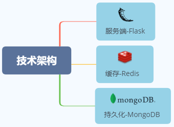
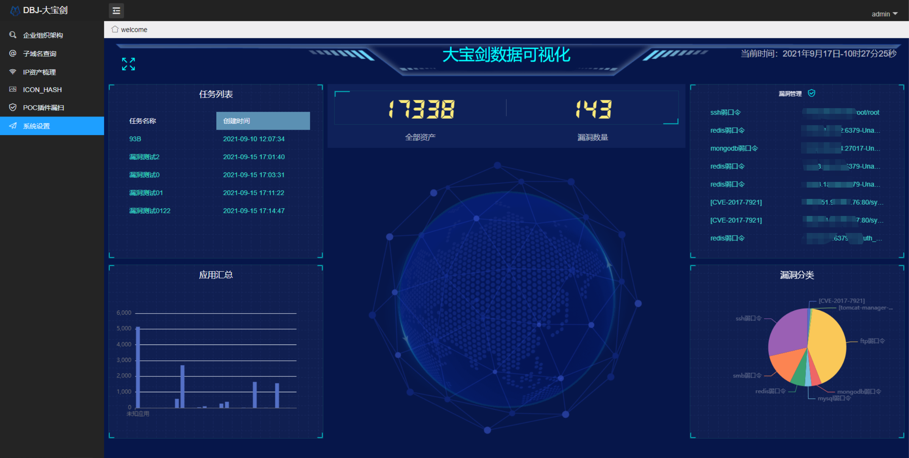
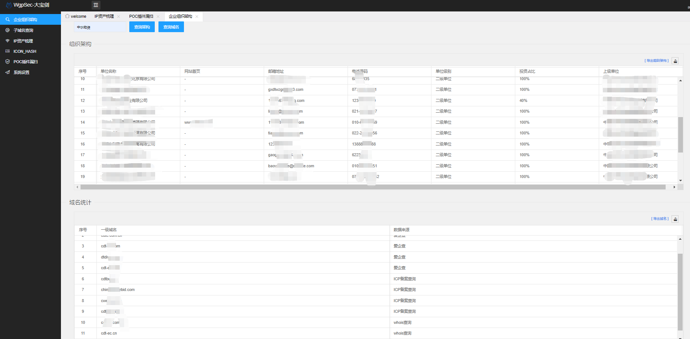
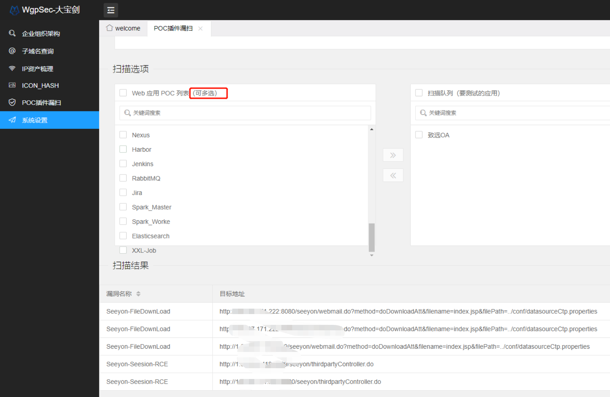

<h1 align="center">DBJ大宝剑 🗡</h1>

    

### 定位：边界资产梳理工具

> 大宝剑的寓意：攻防利刃，简化繁琐操作解放双手，一键大保健~



## 功能简介

bilibili视频地址（不方便拿实际目标演示，取消视频演示）




#### 企业组织架构查询

1、输入企业关键字，自动查询企业的组织架构（网站首页、邮箱、电话、投资占比）

2、默认查询一级单位和二级单位，如需查询三级单位，将二级单位关键字输入查询即可

3、一级域名统计，根据所有的一级和二级单位的名称进行Whois和ICP备案查询并统计一级域名

4、查询结果缓存在Redis，可导出为CSV表格




#### 子域名资产梳理

**任务格式**

```bash
#填写一级域名
baidu.com
```

FOFA-API、https证书、DNS爆破等方式获取子域名资产，自动判断CDN。

**边界IP&Web资产梳理**

**任务格式**

```bash
#填写单个IP 或 C段
111.222.333.444
111.222.333.444/24
```

扫描单IP或C段中Web应用，并识别Web指纹


**导出URL**

导出全部URL，或根据指纹索引匹配资产导出URL，然后扔到别的工具或漏扫里边跑


#### Web指纹识别

识别方式

> 1）HTTP-Header 匹配关键字
>
> 2）HTTP-Body 匹配关键字
>
> 3）ICON_HASH 匹配关键字
>
> 4）错误页面 匹配关键字
>
> 5）特殊路径匹配

Web指纹识别时并未发送恶意请求所以无需代理。


#### ICON_HASH计算

计算图标的哈希值，并自动匹配相关资产


#### POC插件漏扫

> 快！狠！准！

**注意！！！**：**漏扫功能需要在系统设置中填写正确的机器人WebHook地址才能使用，支持钉钉和飞书**



## 安装教程

### Docker 安装模式

##### 一、自己构建镜像
```bash
git clone https://github.com/wgpsec/DBJ.git
cd DBJ
docker build -t dbj_img .							#构建镜像
docker run -it -d --name dbj -p 5000:5000 dbj_img	#启动容器

#如需重新安装，用以下命令删除容器
docker stop dbj
docker rm `docker ps -a -q` && docker rmi -f dbj_img && docker network prune -f
```


##### 二、直接一键启动

```bash
docker run -it -d --name dbj -p 5000:5000 xrsec/dbj:latest
```

访问 http://ip:5000 

##### 三、查看输出信息

```bash
docker logs dbj
```

### 手动安装（Centos）

> 此模式适合开发调试

##### 一、基础环境安装

将`DBJ`放置在系统根目录`\`

```bash
mv /etc/yum.repos.d/CentOS-Linux-BaseOS.repo /etc/yum.repos.d/CentOS-Linux-BaseOS.repo.backup
curl -o /etc/yum.repos.d/CentOS-Linux-BaseOS.repo https://mirrors.aliyun.com/repo/Centos-8.repo
yum makecache

yum -y install yum-utils zlib-devel bzip2-devel openssl-devel ncurses-devel sqlite-devel readline-devel tk-devel libffi-devel gcc make redis

curl -O https://www.python.org/ftp/python/3.9.7/Python-3.9.7.tgz && tar xf Python-3.9.7.tgz;cd Python-3.9.7;./configure;make;make install

echo "alias python='/usr/local/bin/python3.9'" > /etc/profile.d/python.sh && source /etc/profile.d/python.sh

curl -O https://bootstrap.pypa.io/get-pip.py && python get-pip.py -i https://pypi.tuna.tsinghua.edu.cn/simple/

pip install Flask -i https://mirrors.aliyun.com/pypi/simple/

cat  > /etc/yum.repos.d/mongodb.repo << EOF
[mngodb-org]
name=MongoDB Repository
baseurl=http://mirrors.aliyun.com/mongodb/yum/redhat/7Server/mongodb-org/4.0/x86_64/
gpgcheck=0
enabled=1
EOF

yum makecache;yum -y install mongodb-org
pip install -r requirements.txt -i https://mirrors.aliyun.com/pypi/simple/

mkdir -p /root/.config
cp -r /DBJ/data/.config/nuclei /root/.config/nuclei
chmod +x /DBJ/data/nuclei
ln -s /DBJ/data/nuclei /usr/bin/nuclei

```

若mongoDB需要认证

```bash
pkill mongod	#关闭mongodb
mongod -f /etc/mongod.conf	#重新启动mongo
```

##### 二、创建数据库初始数据

```bash
mongo 127.0.0.1:27017/webapp data.js

```

三、启动应用

```bash
sh centos.sh
```

然后打开浏览器访问 IP:5000 登录即可（默认账户密码admin/admin，进去自己改）


